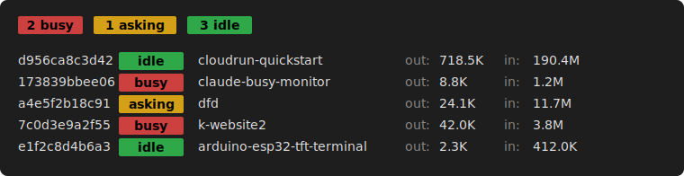

# claude-busy-monitor

[](LICENSE)
[](https://www.python.org/downloads/)

Live view of every [Claude Code](https://docs.claude.com/en/docs/claude-code) session on your machine — which one is **busy**, which one is **asking** for your input, which one is **idle** — with cumulative token totals.



Run several Claude Code sessions in parallel? `claude-busy-monitor` tells you, in one line, how many need attention right now and which project each session is working in — perfect for `watch`, a tmux pane, or a status bar.

## Features

| Feature                | Description                                                                                        |
| ---------------------- | -------------------------------------------------------------------------------------------------- |
| **Live state**         | `busy` / `asking` / `idle` per session, read directly from Claude Code's own session probes        |
| **Summary at a glance**| Coloured pill counts on the first line — eyeball-scannable from across the room                    |
| **Token usage**        | Cumulative input + output tokens per session, summed from the live transcript                      |
| **`watch`-friendly**   | Stable, line-oriented output; no spinners or escape-sequence cursor moves                          |
| **Zero configuration** | Reads `~/.claude/sessions/` and `~/.claude/projects/` — nothing to set up                          |
| **Library + CLI**      | Use the `claude-busy-monitor` command, or import `get_sessions()` from Python                      |

## Quick start

```bash
# Install (dev path until PyPI publish lands; see "Install" below)
git clone https://github.com/pbauermeister/claude-busy-monitor.git
cd claude-busy-monitor
make install

# Run
claude-busy-monitor

# Watch live (refresh every second)
watch -n 1 -c claude-busy-monitor
```

The `-c` flag on `watch` is what preserves the colour pills.

## Install

### For users (PyPI)

PyPI publish is on the roadmap. Until then, use the developer install below.

### For developers

Requires Python 3.11+ and [`uv`](https://github.com/astral-sh/uv) on your `PATH` (one-line install: `pipx install uv`).

```bash
git clone https://github.com/pbauermeister/claude-busy-monitor.git
cd claude-busy-monitor
make venv-activate     # creates .venv, syncs deps, drops you into the shell
make help              # lists every Makefile target
make install           # installs the CLI globally via `uv tool install`
```

## Usage

### CLI

```bash
claude-busy-monitor          # one-shot listing
watch -n 1 -c claude-busy-monitor   # live refresh
```

Output is one summary line followed by one line per session. See the hero above for the layout.

### Library

```python
from claude_busy_monitor import get_sessions, get_state_counts, ClaudeState

for session in get_sessions():
    print(session.session_id, session.state, session.cwd, session.stats)

counts = get_state_counts()
print(f"{counts[ClaudeState.BUSY]} busy, {counts[ClaudeState.ASKING]} asking")
```

Public API: `ClaudeSession`, `ClaudeState`, `TokenStats`, `get_sessions()`, `get_state_counts()`.

## How it works

`claude-busy-monitor` reads two on-disk sources that Claude Code itself writes:

1. `~/.claude/sessions/<pid>.json` — one probe file per live session, with the authoritative `status` field (`busy` / `idle` / `waiting`).
2. `~/.claude/projects/<encoded-cwd>/<sid>.jsonl` — the per-session transcript, used only to total token usage.

State classification is a one-row table — no inference, no heuristics. Token usage sums the four input/output categories from each `assistant.message.usage` entry.

For the full design — including the assumptions the classifier depends on, the diagnostic recipes for when something looks wrong, and the repair playbook — see [README-STATE-DETECTION.md](README-STATE-DETECTION.md).

## Compatibility

- **Operating system**: Linux (relies on `/proc/<pid>/comm`). macOS support is on the roadmap.
- **Claude Code**: requires v2.1.119 or newer (the `status` field was introduced then). Older sessions are silently dropped — `/exit` and `claude --resume <sessionId>` will migrate them.

## Develop

See the developer install above and `make help` for the full target list. The repository carries a test scaffold (`make test-unit`, `make test-smoke`, `make test-e2e`) and a destructive smoke loop (`make cycle`).

## License

[MIT](LICENSE) — see also [CHANGES.md](CHANGES.md) for the version history.
